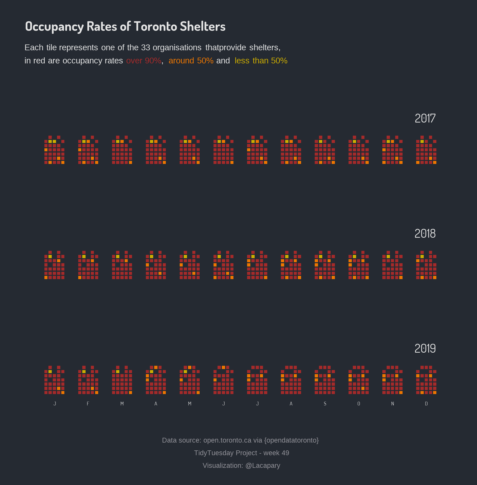

<h1 style="font-weight:normal" align="center">
  &nbsp;TidyTuesday Contributions&nbsp;
</h1>

🐿️[Email][Email]&nbsp;&nbsp;&nbsp;| 🐦[Twitter][Twitter]&nbsp;&nbsp;&nbsp;

<!--
Quick Link
-->

[Twitter]:https://twitter.com/lacapary
[Email]:mailto:lc.pacheco27@gmail.com

My contributions to the [#TidyTuesday challenge](https://github.com/rfordatascience/tidytuesday), a weekly social data project that focuses on understanding how to summarize and arrange data to make meaningful and/or beautiful charts with `{ggplot2}`, `{tidyr}` and other tools that are part of the [`{tidyverse}`](https://www.tidyverse.org/).
Feedback is very welcome via [Twitter](https://twitter.com/lacapary).

Contributions in chronological order 

* **Challenges 2020** 

[Week 39](https://github.com/Lacapary/T_Tuesday/blob/master/codes/2020/week-39.md)  ⛰️Himalayan Climbing Expeditions   
[Week 40](https://github.com/Lacapary/T_Tuesday/blob/master/codes/2020/week-40.md)  🎵Taylor Swift´s Lyrics  
[Week 41](https://github.com/Lacapary/T_Tuesday/blob/master/codes/2020/week-41.md)  🏀Women in NCAA tournament  
[Week 42](https://github.com/Lacapary/T_Tuesday/blob/master/codes/2020/week-42.md)  🦖The importance of Data Visualization  
[Week 43](https://github.com/Lacapary/T_Tuesday/blob/master/codes/2020/week-43.md)  🍻Brewing in USA  
[Week 44](https://github.com/Lacapary/T_Tuesday/blob/master/codes/2020/week-44.md)  🀃Canadian Wind Turbines  
[Week 45](https://github.com/Lacapary/T_Tuesday/blob/master/codes/2020/week-45.md)  🛏️IKEA Prices in Saudi Arabian   
[Week 46](https://github.com/Lacapary/T_Tuesday/blob/master/codes/2020/week-46.md)  📱Historical Phone Usage    
[Week 48](https://github.com/Lacapary/T_Tuesday/blob/master/codes/2020/week-48.md)  🥾 Washington Hiking   

### Last contribution

[Week 49](https://github.com/Lacapary/T_Tuesday/blob/master/codes/2020/week-49.md)  🏠 Toronto Shelters   
 
***

###### *Attribution-NonCommercial-ShareAlike 4.0 International (CC BY-NC-SA 4.0)*

