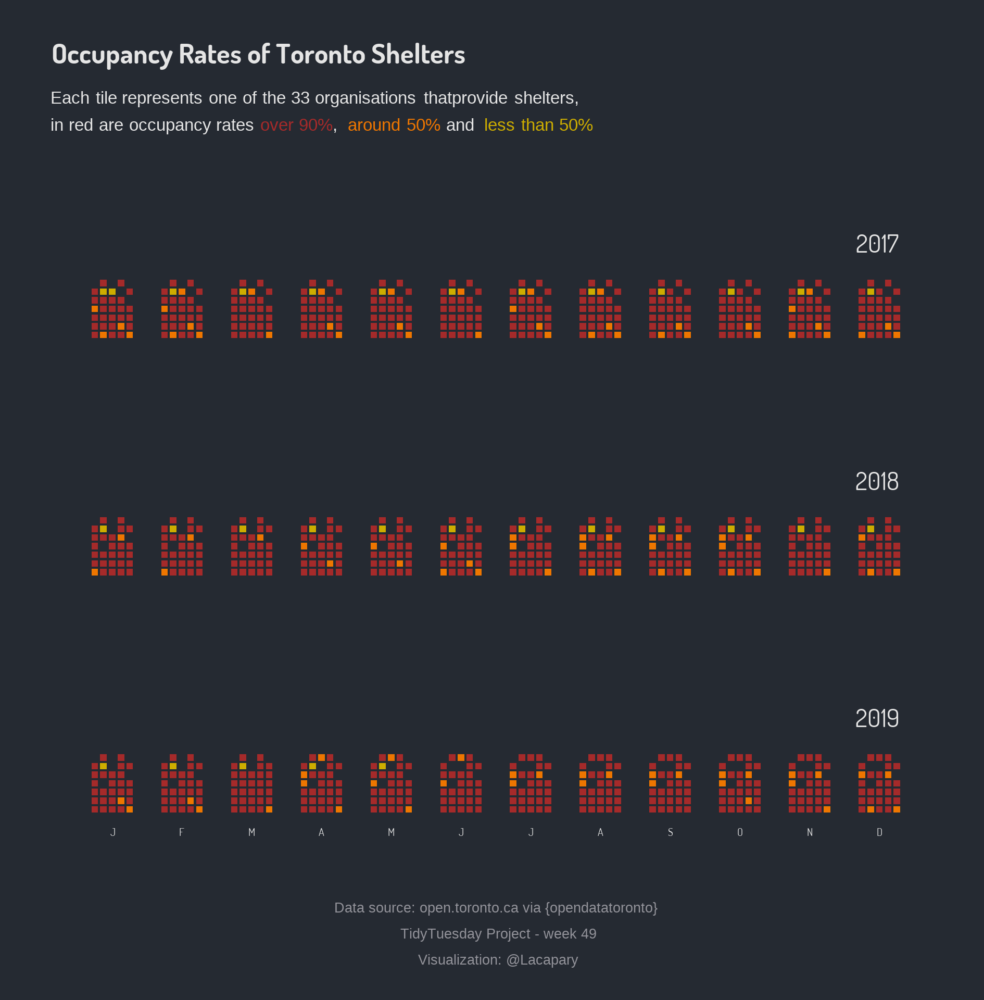

```{r setup, include=FALSE}
knitr::opts_chunk$set(
  fig.path = "README_figs/README-")
```

# Toronto Shelters

 Libraries and settings
```{r results='hide', message=FALSE, warning=FALSE}
library(tidyverse)
library(tidytuesdayR)
library(sysfonts)
library(showtext)
library(ggtext)
```
# Load the weekly Data

Dowload the weekly data and make available in the `tt` object.
```{r  results='hide', message=FALSE, warning=FALSE}
data <- tidytuesdayR::tt_load("2020-12-01")
shelters<-data$shelters
```

The data this week comes from [opendatatoronto](https://sharlagelfand.github.io/opendatatoronto/). 

# Data

Using the dataset to create unique visualization.

```{r Visualize, message=FALSE, warning=FALSE}
#library for dates
library(lubridate)

sqrts <- shelters %>%
  mutate(month = month(occupancy_date),
         year = year(occupancy_date)) %>%
  group_by(year, month, organization_name) %>%
  summarise(
    occupancy = sum(occupancy, na.rm = TRUE),
    capacity = sum(capacity, na.rm = TRUE)
  ) %>%
  ungroup() %>%
  mutate(
    occupancy_status = case_when(
      occupancy >= 0.90 * capacity  ~ "#A52A2A",
      occupancy >= 0.50 * capacity & occupancy < 0.90 * capacity ~"#EE7600",
      occupancy <= 0.5 ~ "grey20",
      TRUE ~ "#CDAD00"
    ),
    org_n = as.numeric(as.factor(organization_name)),
    org_y = (org_n + 4) %/% 5,
    org_x = (org_n - 1) %% 5 - 2,
    org_x = if_else(org_y == max(org_y), org_x + 1, org_x)
  )
  
```
# Theme
```{r theme, message=FALSE, warning=FALSE}

font_add_google("Dosis", "Dosis")
showtext_auto()
theme_set(hrbrthemes::theme_ft_rc(base_family = "Dosis",
                                  base_size = 15))

```

# Creating plot

```{r Canada_shelters,warning=FALSE, fig.width=6.3, fig.height=6.4}


p<-sqrts %>% ggplot() +
  geom_tile(aes(
    month * 8  + org_x,
    org_y,
    fill = occupancy_status,
    height = 0.75,
    width = 0.75
  )) +
  scale_fill_identity() +
  scale_x_continuous(breaks = 8 * 1:12, labels = toupper(
    c(
      "J",
      "F",
      "M",
      "A",
      "M",
      "J",
      "J",
      "A",
      "S",
      "O",
      "N",
      "D"
    )
  )) +
  
  facet_wrap(~year, ncol = 1) +
	labs(
		title = "Occupancy Rates of Toronto Shelters",
		subtitle = "Each tile represents one of the 33 organisations thatprovide shelters, <br> in red are occupancy rates <span style = 'color:#A52A2A;'>over 90%</span>, <span style = 'color:#EE7600;'> around 50%</span> and  <span style = 'color:#CDAD00;'> less than 50%</span>  ",
		caption = "Data source: open.toronto.ca via {opendatatoronto} \n TidyTuesday Project - week 49 \n Visualization: @Lacapary" ) +
  theme(
    axis.title.x = element_blank(),
    axis.ticks.x = element_blank(),
    axis.title.y = element_blank(),
    axis.ticks.y = element_blank(), 
    axis.text.y = element_blank(),
    panel.grid.major = element_blank(),
    panel.grid.minor = element_blank(),
    axis.text.x = element_text(
      color = "grey90",
      margin = margin(2, 0, 0, 0)
    ),
    strip.text = element_text(
       color = "grey90",
      size = 36,
      hjust = 0.95,
      margin = margin(30, 0, 10, 0)
    ),
    plot.margin = margin(20, 20, 15, 20),
    plot.title = element_text(
      color = "grey90",
      size = 40
    ),
    plot.subtitle = element_markdown(color = "grey90", lineheight = 0.5,size = 25),
    plot.caption = element_text(
      hjust = 0.5,
     margin = margin(30, 0, 0, 0),
     lineheight = 0.5,
     size = 20)
    )+
  ggsave(here::here("codes/README_figs","shelters_Week49.png"), dpi = 300, width = 6.3, height = 6.4)

```
<center>
{
width=50% }
</center>