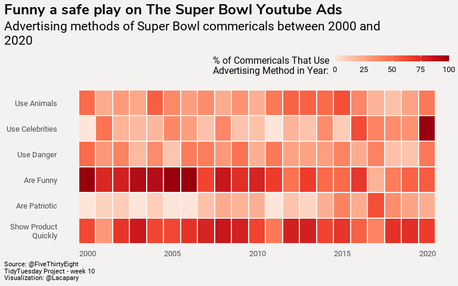

Week 10
================

# Superbowl-ads

Libraries and settings

``` r
library(tidyverse)
library(tidytuesdayR)
library(showtext)
library(ggtext)
library(scales)
font_add_google("Nunito Sans", "Nunito Sans")
font_add_google("Roboto", "Roboto")
showtext_auto()
```

# Load the weekly Data

Download the weekly data and make available in the `tt` object.

``` r
data <- tidytuesdayR::tt_load("2021-03-02")

yt <- data$youtube
```

The data this week comes from
[FiveThirtyEight](https://github.com/fivethirtyeight/superbowl-ads).

# Glimpse Data

Take an initial look at the format of the data available.

``` r
yt %>% 
  map(glimpse)
```

# Wrangle

``` r
yt <- yt  %>% 
  rename("sex" = "use_sex") %>% 
  mutate(brand = recode(brand, "Hynudai" = "Hyundai")) %>% 
  distinct(id, superbowl_ads_dot_com_url, .keep_all = TRUE) %>%
  mutate(
    ad_id = row_number(),
    across(
      c(funny, show_product_quickly, patriotic, celebrity, danger, animals, sex), 
      as.integer
    )
  ) %>%
  select(
    year, ad_id, funny, show_product_quickly, patriotic, celebrity, danger, animals, sex
  ) %>%
  pivot_longer(
    c(funny, show_product_quickly, patriotic, celebrity, danger, animals, sex),
    names_to = "characteristic", values_to = "present"
  ) %>%
  group_by(year) %>%
  mutate(n_ads = n_distinct(ad_id)) %>%
  group_by(n_ads, year, characteristic) %>%
  summarise(sum_char = sum(present)) %>%
  ungroup() %>%
  mutate(
    percent_usage = sum_char/ n_ads,
    characteristic = str_replace_all(characteristic, "_", " "),
    characteristic = str_to_title(characteristic),
    characteristic = case_when(
      characteristic == "sex" ~ "Use Sex",
      characteristic == "Show Product Quickly" ~ "Show Product\nQuickly",
      characteristic == "Patriotic" ~ "Are Patriotic",
      characteristic == "Funny" ~ "Are Funny",
      characteristic == "Danger" ~ "Use Danger",
      characteristic == "Celebrity" ~ "Use Celebrities",
      characteristic == "Animals" ~ "Use Animals"
    ),
    characteristic = fct_rev(as_factor(characteristic))
  )
```

# Visualize

Using the dataset to create unique visualization.

``` r
p <-ggplot(yt %>% drop_na(characteristic),
       aes(year, characteristic, fill = percent_usage)) +
  geom_tile(color= "#f3f2f1", size = 1) +
  scale_fill_distiller(direction = 1,
                       palette = "Reds",
                       labels = number_format(scale = 100)) +
  labs(
    title = "Funny a safe play on The Super Bowl Youtube Ads",
    subtitle = str_wrap(
      "Advertising methods of Super Bowl commericals between 2000 and 2020",
      65
    ),
    fill = "% of Commericals That Use\nAdvertising Method in Year:",
    caption = "Source: @FiveThirtyEight \nTidyTuesday Project - week 10 \nVisualization: @Lacapary",
    x = NULL,
    y = NULL
  ) +
  guides(fill = guide_colourbar(barwidth = 10, barheight = 0.5))+
  theme(
    # Use 10.6667 for larger plots, 8 for smaller
    text = element_text(family = "Roboto", size = 8),
    plot.title = element_text(
      family = "Nunito Sans",
      size = 18,
      face = "bold"
    ),
    plot.subtitle = element_text(size = rel(2)),
    axis.title = element_text(size = rel(1.5), hjust = 0),
    axis.title.y = element_text(angle = 0),
    legend.title = element_text(size = rel(1.5)),
    plot.caption = element_text(size = rel(1), hjust = 0),
    axis.text = element_text(size = rel(1.25)),
    legend.text = element_text(size = rel(1.25)),
    plot.title.position = "plot",
    plot.caption.position = "plot",
    legend.position = "top",
    legend.justification=c(1, 1),
    axis.ticks = element_blank(),
    panel.grid = element_blank(),
    rect = element_blank(),
    plot.background = element_rect(fill = '#f3f2f1', color = '#f3f2f1'),
    legend.background = element_rect(fill = '#f3f2f1', color = '#f3f2f1')
  )
p
```

<!-- -->
