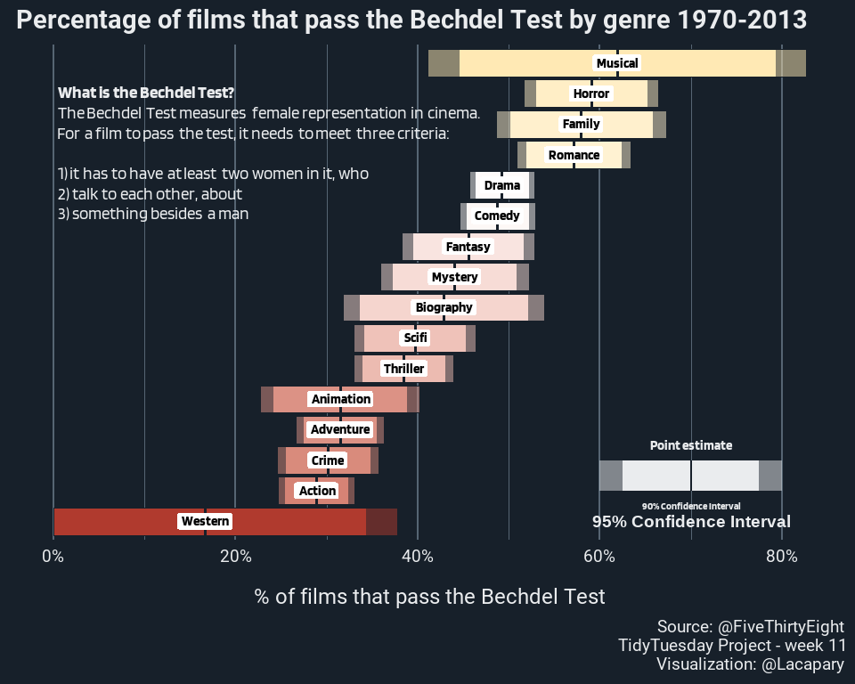

Week 11
================

# Bechdel Test

Libraries and settings

``` r
library(tidyverse)
library(tidytuesdayR)
library(showtext)
library(ggtext)
library(scales)
font_add_google("Blinker", "Blinker")
font_add_google("Roboto", "Roboto")
showtext_auto()
```

# Load the weekly Data

Download the weekly data and make available in the `tt` object.

``` r
data <- tidytuesdayR::tt_load("2021-03-09")

movies <- data$movies
raw_be <- data$raw_bechdel
```

The data this week comes from
[FiveThirtyEight](https://github.com/fivethirtyeight/data/tree/master/bechdel).

# Glimpse Data

Take an initial look at the format of the data available.

``` r
movies %>% 
  map(glimpse)
```

# Wrangle

``` r
movies_ext <- movies %>%
  filter(!is.na(genre)) %>%
  mutate(binary = ifelse(binary == "PASS", 1, 0)) %>%
  mutate(
    action = ifelse(str_detect(genre, "Action"), 1, 0),
    adventure = ifelse(str_detect(genre, "Adventure"), 1, 0),
    animation = ifelse(str_detect(genre, "Animation"), 1, 0),
    biography = ifelse(str_detect(genre, "Biography"), 1, 0),
    comedy = ifelse(str_detect(genre, "Comedy"), 1, 0),
    crime = ifelse(str_detect(genre, "Crime"), 1, 0),
    documentary = ifelse(str_detect(genre, "Documentary"), 1, 0),
    drama = ifelse(str_detect(genre, "Drama"), 1, 0),
    family = ifelse(str_detect(genre, "Family"), 1, 0),
    fantasy = ifelse(str_detect(genre, "Fantasy"), 1, 0),
    horror = ifelse(str_detect(genre, "Horror"), 1, 0),
    musical = ifelse(str_detect(genre, "Musical"), 1, 0),
    mystery = ifelse(str_detect(genre, "Mystery"), 1, 0),
    romance = ifelse(str_detect(genre, "Romance"), 1, 0),
    scifi = ifelse(str_detect(genre, "Sci-Fi"), 1, 0),
    thriller = ifelse(str_detect(genre, "Thriller"), 1, 0),
    western = ifelse(str_detect(genre, "Western"), 1, 0)
  ) %>%
  select(binary, action:western) %>%
  gather(genre, flag, -binary) %>%
  filter(flag == 1)
 
movies_agg <- movies_ext %>% 
  group_by(genre) %>% 
  summarise(score = mean(binary),
            n = n()) %>% 
  ungroup() %>% 
  mutate(se = sqrt((score * (1 - score)) / n),
         ci_upper = score + se * 1.96,
         ci_lower = score - se * 1.96,
         ci_upper90 = score + se * 1.645,
         ci_lower90 = score - se * 1.645) %>% 
  mutate(ci_lower = ifelse(ci_lower < 0, 0, ci_lower)) %>% 
  mutate(ci_lower90 = ifelse(ci_lower90 < 0, 0, ci_lower90))

explainer <- glue::glue(paste0("<b>What is the Bechdel Test?</b><br>The Bechdel Test measures female representation in cinema.<br>For a film to pass the test, it needs to meet three criteria:<br><br>1) it has to have at least two women in it, who<br>2) talk to each other, about<br>3) something besides a man"))
```

# Visualize

Using the dataset to create unique visualization.

``` r
p<-movies_agg %>% 
  filter(!genre == "documentary") %>% 
  mutate(genre = str_to_title(genre)) %>% 
  mutate(genre = reorder(genre, score)) %>% 
   ggplot(aes(genre, score, group = 1)) +
  # geom_image(aes(image = img), size=.05) +
  geom_crossbar(aes(min = ci_lower90, ymax = ci_upper90, fill = score), color = "#17202A") +
  geom_crossbar(aes(min = ci_lower, ymax = ci_upper, fill = score), alpha = 0.5, color =  "#17202A") +
  geom_point(aes(color = score), size = 3) +
  geom_label(aes(label = genre), family = "Blinker", label.size = NA, color = "black", fontface = "bold") +
  annotate("richtext", size = 5,  x = 13, y = 0, label = explainer, label.size = NA, fill = NA, color = "#EAECEE",
           family = "Blinker", hjust = 0) +
  annotate("rect", xmin = 2, xmax = 3, ymin = .625, ymax = .775, fill = "#EAECEE") +
  annotate("rect", xmin = 2, xmax = 3, ymin = .6, ymax = .8, fill = "#EAECEE", alpha = 0.5) +
  annotate("segment", x = 2, xend = 3, y = .7, yend = .7, size = 1, color = "#17202A") +
  annotate("text", x = 3.5, y = .7, color = "#EAECEE", label = "Point estimate", family = "Blinker", fontface = "bold") +
  annotate("text", x = 1.5, y = .7, color = "#EAECEE", label = "90% Confidence Interval", family = "Blinker", fontface = "bold",size=3) +
  annotate("text", x = 1, y = .7, color = "#EAECEE", label = "95% Confidence Interval", family = "Blinkery", fontface = "bold",size=5) +
   labs(title = "Percentage of films that pass the Bechdel Test by genre 1970-2013",
       x = "",
       y = "% of films that pass the Bechdel Test",
       caption = "Source: @FiveThirtyEight \nTidyTuesday Project - week 11 \nVisualization: @Lacapary") +
  scale_y_continuous(labels = percent) +
  scale_color_gradient2(high = "#F1C40F", low = "#B03A2E",
                        midpoint = 0.5) +
  scale_fill_gradient2(high = "#F1C40F", low = "#B03A2E",
                        midpoint = 0.5) +
  theme_minimal(base_size = 18) +
  theme(axis.title.y = element_blank(),
        axis.text.y = element_blank(),
        panel.grid.minor.y = element_blank(),
        panel.grid.major.x = element_line(color = "#566573"),
        panel.grid.minor.x = element_line(color = "#566573"),
        panel.grid.major.y = element_blank(),
        plot.title = element_text(face = "bold", hjust = 0),
        plot.subtitle = element_text(hjust = 0, size = 17, margin = margin(0, 0, 20, 0)),
        axis.text.x = element_text(color = "#EAECEE"),
        axis.title.x = element_text(margin = margin(20, 0, 0, 0)),
        panel.background = element_rect(fill = "#17202A", color = "#17202A"),
        plot.background = element_rect(fill = "#17202A", color = "#17202A"),
        plot.caption = element_text(margin = margin(10, 0, 0, 0)),
        text = element_text(color = "#EAECEE", family = "Roboto")) +
  guides(color = FALSE, fill = FALSE) +
  coord_flip()
p
```

<!-- -->
