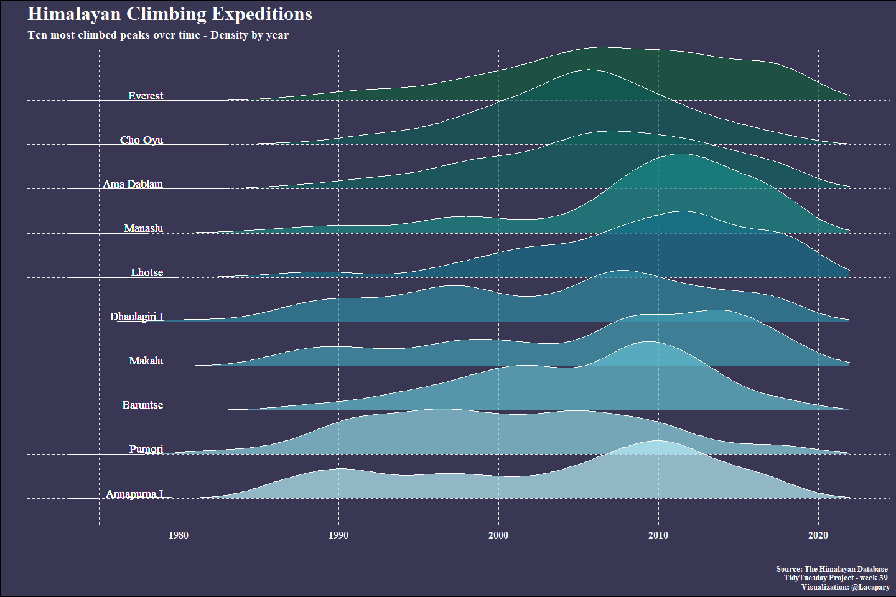

Tidy Tuesday
================

Libraries and settings

Load data

``` r
data <- tidytuesdayR::tt_load(2020, week = 39)
```

    ## 
    ##  Downloading file 1 of 3: `peaks.csv`
    ##  Downloading file 2 of 3: `members.csv`
    ##  Downloading file 3 of 3: `expeditions.csv`

``` r
expeditions<-data$expeditions
```

Arranging values

``` r
 expeditions_2 <- expeditions %>% 
  drop_na() %>% 
  #The most comon peak_name
  mutate(peak_name = fct_lump_n(peak_name, n = 10)) %>%
  filter(peak_name != "Other") %>%
  mutate(peak_name = fct_reorder(peak_name, year, .fun = sum))
```

Colors and font

``` r
back_color <-c("#393754")
font_color <-"#ffffffff"
palette <- c("#B7EEF7", "#8FD6E3", "#63BDCF", "#429EB3", "#2E889E", "#166E87", "#178A86", "#106360", "#0F5957", "#105C3B")
```

Theme update

``` r
theme_set(theme_minimal(base_size=15) +
            theme(
              title=element_text(family="serif", 
                                 face = "bold", size=20),
              plot.subtitle=element_text(size = 14),
              panel.background=element_rect(fill = back_color, 
                                            color = back_color),
              plot.background=element_rect(fill = back_color),
              panel.grid=element_line(linetype="dashed"),
              text=element_text(color = font_color, face="bold", family = "serif"),
              axis.text=element_text(color = font_color),
              axis.text.y=element_blank(),
              plot.caption=element_text(size = 10),
            )
      )
```

Plot setup

``` r
plot <-  expeditions_2  %>% 
  ggplot(aes(x = year, y = peak_name))+
  geom_density_ridges(aes(fill = peak_name), 
                      alpha = .7, color = font_color, show.legend=F)+
  scale_fill_manual(values = palette)+
  scale_x_continuous(limits=c(1973, 2022), breaks=seq(1980, 2020, 10))+
  geom_text(aes(x=1979, y = peak_name, 
                label = peak_name), vjust = -0.2, hjust = 1,
            color = font_color,  
            family = "serif",size = 5)+
  labs(title = "Himalayan Climbing Expeditions",
       subtitle= "Ten most climbed peaks over time - Density by year",
       y = "", x = "",
       caption = "Source: The Himalayan Database \nTidyTuesday Project - week 39 \n Visualization: @Lacapary")
```

\#Plot

    ## Picking joint bandwidth of 2.08

<!-- -->
