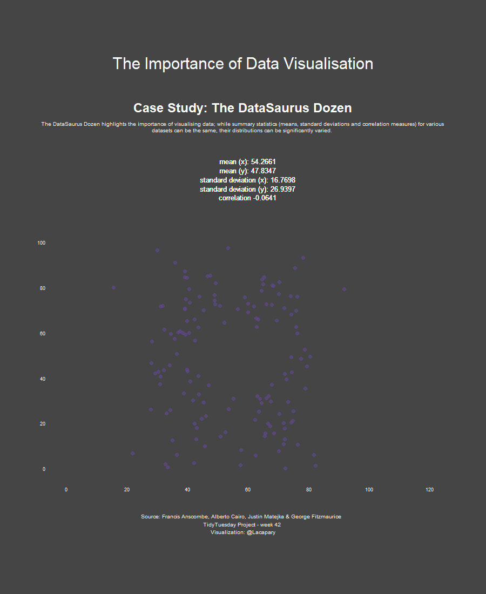

Week 42
================

Libraries and settings

``` r
library(tidyverse)
library(tidytuesdayR)
library(rcartocolor)
library(gganimate)
library(ggtext)
library(here)
```

# Load the weekly Data

Dowload the weekly data and make available in the `tt` object.

``` r
datasaurus <-readr::read_csv('https://raw.githubusercontent.com/rfordatascience/tidytuesday/master/data/2020/2020-10-13/datasaurus.csv')

glimpse(datasaurus)

colours <- c(carto_pal(12, "Prism"), "#000000")
```

# Visualize

Using your processed dataset, create your unique visualization.

``` r
datasaurus<-datasaurus %>%
  group_by(dataset) %>%
  summarise(mean_x = mean(x),
            mean_y = mean(y),
            sd_x   =   sd(x),
            sd_y   =   sd(y),
            coefficient  = cor(x, y, method = "pearson")) %>%
  left_join(datasaurus)

p<-datasaurus %>%   ggplot(aes(x = x, y = y)) +
  #set same limits for x and y coords
  #coord_equal(clip = "off") +
  geom_point(aes(colour = dataset, group = 1L),
             size = 3,
             alpha = 0.6) +
   scale_color_manual(values = colours, guide = "none") +
  scale_x_continuous(limits = c(0, 120), breaks = seq(0, 120, by = 20)) +
  scale_y_continuous(limits = c(0, 140), breaks = seq(0, 100, by = 20)) +
  geom_text(
    aes(
      x = 60,
      y = 136,
      label = paste("mean (x):", round(mean_x, 4))
        ),
    hjust = 0.5,
    size = 4.5,
    color = "white"
  ) +
  geom_text(
    aes(
      x = 60,
      y = 132,
      label = paste("mean (y):", round(mean_y, 4))
    ),
    hjust = 0.5,
    size = 4.5,
    color = "white"
  ) +
  geom_text(
    aes(
      x = 60,
      y = 128,
      label = paste("standard deviation (x):", round(sd_x, 4))
    ),
    hjust = 0.5,
    size = 4.5,
    color = "white"
  ) +
  geom_text(
    aes(
      x = 60,
      y = 124,
      label = paste("standard deviation (y):", round(sd_y, 4))
    ),
    hjust = 0.5,
    size = 4.5,
    color = "white"
  ) +
  geom_text(
    aes(
      x = 60,
      y = 120,
      label = paste("correlation", round(coefficient, 4))
    ),
    hjust = 0.5,
    size = 4.5,
    color = "white"
  ) +
  labs(title = "The Importance of Data Visualisation",
       subtitle = "<b style='font-size:24pt;'>Case Study: The DataSaurus Dozen</b><br><br>The DataSaurus Dozen highlights the importance of visualising data; while summary statistics (means, standard deviations and correlation measures) for various datasets can be the same, their distributions can be significantly varied. ",
       caption = " Source: Francis Anscombe, Alberto Cairo, Justin Matejka & George Fitzmaurice  \nTidyTuesday Project - week 42 \nVisualization: @Lacapary") +
  theme_minimal() +
  theme(
    plot.title = element_text(    size = 30,
                                  color = "white",
                                  hjust = 0.5,
                                  margin = margin(15, 0, 40, 0)),
        plot.title.position = "plot",
        plot.subtitle = element_textbox_simple( 
                                     size = 10,
                                     color = "white", 
                                     halign = 0.5,
                                     lineheight = 1.2,
                                     margin = margin(10, 0, 0, 0)),
        plot.caption = element_text(
                                    size = 10,
                                    colour = "white",
                                    lineheight = 1.2,
                                    hjust = 0.5,
                                    margin = margin(40, 0, 20, 0)),
        plot.caption.position = "plot",
        axis.title.x = element_blank(),
        axis.title.y = element_blank(),
        axis.text.x = element_text(colour = "white"),
        axis.text.y = element_text(colour = "white"),
        panel.grid.major = element_blank(),
        panel.grid.minor = element_blank(),
        plot.margin = margin(90, 70, 90, 70),
        plot.background = element_rect(color = "grey27", fill = "grey27")) +
  transition_states(dataset, 10, 3) + 
  ease_aes('cubic-in-out') 
```

# Plot

<!-- -->
