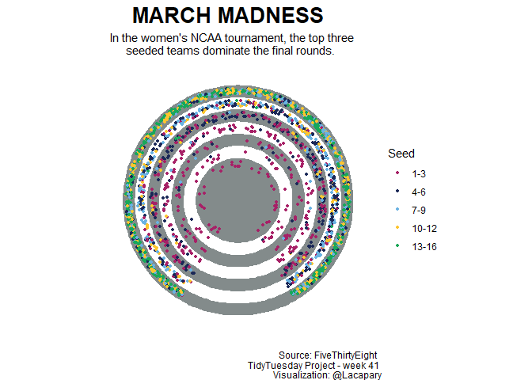

Week 44
================

Libraries and settings

``` r
library(tidyverse)
library(tidytuesdayR)
library(extrafont)
library(ggtext)
library(treemapify)
library(scales)
loadfonts(device = "win")
```

# Load the weekly Data

Dowload the weekly data and make available in the `tt` object.

``` r
data <- tidytuesdayR::tt_load("2020-10-27")
w_turbine<-data$`wind-turbine`
glimpse(w_turbine)
```

# Visualize

Using the dataset to create unique visualization.

``` r
p<-w_turbine %>%
  group_by(province_territory, manufacturer) %>%
  summarize(num_turb = n(),
            total_cap = sum(total_project_capacity_mw)) %>%
  ggplot(aes(area = num_turb,
             fill = total_cap,
             label = manufacturer)) +
  geom_treemap() +
  geom_treemap_text(colour = "black",
                    place = "centre",
                    grow = FALSE) +
  scale_fill_gradient(
    low = "#FAF5C5D8",
    high = "#08615B",
    #changing number format to thousand
    labels = unit_format(unit = "k", scale =  1e-3)
  ) +
  labs(
    title = "Canadian Wind Turbines ",
    subtitle = "The area of each manufacturer is proportional to the number of turbines within the Province/Territory",
    caption = "Source:  Government of Canada \n TidyTuesday Project - week 44 \n Visualization: @Lacapary",
    fill = "Wind Turbine Power\nGeneration Capactiy (MW)"
  ) +
  theme_bw() +
  theme(
    text = element_text(family = "Segoe UI Light"   ),
    legend.title=element_text(size=10),
    plot.title = element_text(face = "bold"),
    legend.position = "bottom",
    legend.key.width = unit(2.5, "cm"),
    strip.background = element_rect( fill="white" )
    ) +
  facet_wrap(~ province_territory)
```

<!-- -->
